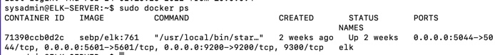

## Automated ELK Stack Deployment

The files in this repository were used to configure the network depicted below.

These files have been tested and used to generate a live ELK deployment on Azure. They can be used to either recreate the entire deployment pictured above. Alternatively, select portions of the `ansible-playbookelk.yml` file may be used to install only certain pieces of it, such as Filebeat.

This document contains the following details:
- Description of the Topologu
- Access Policies
- ELK Configuration
  - Beats in Use
  - Machines Being Monitored
- How to Use the Ansible Build

### Description of the Topology

The main purpose of this network is to expose a load-balanced and monitored instance of DVWA, the D*mn Vulnerable Web Application.

Load balancing ensures that the application will be highly `available`, in addition to restricting `unauthorized access` to the network.

Integrating an ELK server allows users to easily monitor the vulnerable VMs for changes to the `logs` and system `metrics`.

The configuration details of each machine may be found below.
_Note: Use the [Markdown Table Generator](http://www.tablesgenerator.com/markdown_tables) to add/remove values from the table_.

| Name       | Function        | IP Address | Operating System |
|------------|-----------------|------------|------------------|
| Jump Box   | Gateway         | 10.0.0.4   | Linux            |
| Elk Server | SIEM            | 10.2.0.4   | Linux            |
| Web1       | Web Application | 10.0.0.5   | Linux            |
| Web2       | Web Application | 10.0.0.6   | Linux            |

### Access Policies

The machines on the internal network are not exposed to the public Internet. 

Only the `JumpBox` machine can accept connections from the Internet. Access to this machine is only allowed from the following IP addresses: `47.41.28.251`

Machines within the network can only be accessed by the administrator machine with public IP of `47.41.28.251` through the `JumpBox` with an internal IP address of `10.0.0.4`.

A summary of the access policies in place can be found in the table below.

| Name       | Publicly Accessible | Allowed IP Address     |
|------------|---------------------|------------------------|
| Jump Box   | Yes                 | 10.0.0.4, 47.41.28.251 |
| Elk Server | Yes                 | 47.41.28.251           |
| Web1       | Yes                 | 47.41.28.251           |
| Web2       | Yes                 | 47.41.28.251           |

### Elk Configuration

Ansible was used to automate configuration of the ELK machine. No configuration was performed manually, which is advantageous because `it allows for a repeatable process that is less error prone.`

The playbook implements the following tasks:
- Installs Docker
- Installs Python3-pip
- Installs Docker module
- Increases virtual memory
- Downloads and installs docker Elk container

The following screenshot displays the result of running `docker ps` after successfully configuring the ELK instance.

### Target Machines & Beats
This ELK server is configured to monitor the following machines:
- 10.0.0.5
- 10.0.0.6

We have installed the following Beats on these machines:
- Filebeat
- Metricbeat

These Beats allow us to collect the following information from each machine:
- Filebeat is used to collect common system logs such as Windows logs and Linux logs such as auth logs, mail logs, http logs, etc. 
- Metricbeat collects system metrics such as CPU usage, memory, file system, disk IO and network IO statistics.

### Using the Playbook
In order to use the playbook, you will need to have an Ansible control node already configured. Assuming you have such a control node provisioned: 

SSH into the control node and follow the steps below:
- Copy the `elk.yaml` file to `/etc/ansible/`.
- Update the `hosts` file to include target machines to install specific software to and a username to use.
- Run the playbook, and navigate to `http://104.42.147.243:5601/app/kibana#/home` to check that the installation worked as expected.
